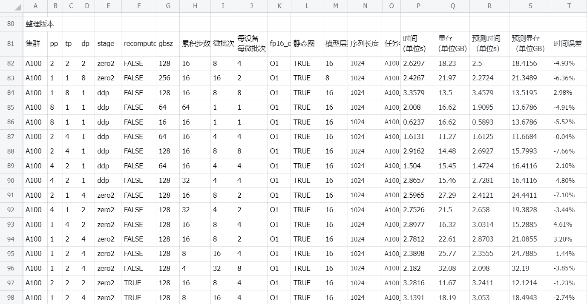

# Overview
`Galvatron` is an automatic parallelism system designed for `Transformer` models. It searches for the optimal parallel strategy under specific cluster environments and model configurations to achieve efficient computation.

# System Architecture
The `Galvatron` architecture consists of three core modules:

- Performance Analyzer
    - Hardware Performance Analyzer: Measures the bandwidth of key operators between devices for different parallel strategies.
    - Model Performance Analyzer: Analyzes the computation patterns and memory requirements of different model components.
    - Runtime Performance Analyzer: Monitors the runtime and memory usage of a single model iteration, integrated into the `AutoTrainer` class.

- Load Estimator
Based on data from the performance analyzer, it models the runtime and memory overhead for a given parallel strategy under specific cluster and model configurations. The estimation error is small (typically within 5% on A100 clusters, as shown in the figure below).


- Strategy Search Engine
Generates all feasible parallel strategies and, based on the accuracy of the load estimator, quickly and efficiently finds the optimal parallel strategy for a given batch size and accumulation steps.

# Usage Workflow
A complete example for `llama-7b` is provided in `./llm/auto_parallel/galvatron-llama`.

- Analyze Hardware Performance
```
    cd ./llm/auto_parallel/galvatron-llama
    bash scripts/profile_hardware.sh
```
- Analyze Model Performance
Run the following commands to generate computation time and memory performance configuration files:
```
    bash scripts/profile_computation.sh
    bash scripts/profile_memory.sh
```
- Validate Cost Model
Configure the paths to the performance configuration files, parallel strategy, batch size, and accumulation steps in `check_cost_model.sh`. Then run the following command to predict execution time and memory overhead. To verify modeling accuracy, you can modify the same configuration in `train_dist_random.sh` and execute it to obtain real performance data.

```
    bash scripts/check_cost_model.sh
```

- Search for the Optimal Parallel Strategy
Run the following command to search for the optimal parallel strategy for a given list of batch sizes. The results will be saved to `configs/optimal_solution.json`:
```
    bash scripts/search_dist.sh
```